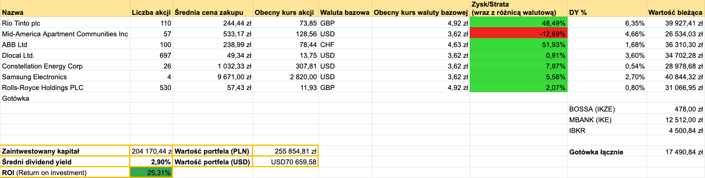

+++
title = "Podsumowanie portfela - kwiecień 2026"
description = "Wycena portfela przekroczyła ćwierć miliona złotych!" 
tags = [
    "podsumowanie"
]
date = 2026-05-03T09:00:00Z
author = "dywidendowo"
+++

Mamy upgarnioną wiosnę. Majówka w pełni, 26 stopni i słodkie nic nierobienie. Niemniej koniec kwietnia to znak, żeby podsumować portfel #dywidendowopl ☀️

**➡️ Sprzedaż/Zakup spółek z portfela.**

W kwietniu naprawdę sporo się działo na rynkach i w moim portfelu również. Zacząłem od powiększenia pozycji na CEG i dokupiłem 10 akcji po cenie około 273\$. Dokupiłem jedną akcję MAA na koncie IKE po cenie około 122,85$. Następnie powiększyłem pozycję na spółce DLO i wpadło 100 akcji po średniej cenie 12,68\$. Sprzedałem mały pakiet 10 akcji ABB i zrealizowałem niewielki profit (potrzebowałem gotówki na inne zakupy). Natomiast mimo 50% niezrealizowanego zysku zamierzam powiększyć pozycję na tej spółce. ABB dowozi bardzo solidne wyniki i widzę w niej konia pociągowego dla całego portfela przez najbliższe lata. Elektryfikacja i zwiększenie zapotrzebowania na energię to będzie niegasnący problem najbliższych lat. Zbierane akcje MSFT od połowy lutego sprzedałem z zyskiem około 4500zł. Obawiałem się, że reakcja na wyniki finansowe nie będzie zbyt pozytywna i faktycznie tak było. Mimo dobrych wyników, kurs zanurkował o około 7%. MSFT od początku roku -12%. Wydaje że nastawienie do spółek Software'owych / SaaS (przykład NOW) tak szybko się nie odwróci. Chociaż np. zdołowany Atlassian, po wynikach znowu odzyskuje powoli blask (mimo -42% YTD 😆).
W związku z tym zamiast wracac do MSFT przerzuciłem środki na zakup akcji Samsung (stawiając mocniej na hardware i wzrost zapotrzebowania na pamięć), notowanych również na LSE. Początkowo kupiłem trzy akcje, żeby po świetnych wynikach finansowych dokupić jeszcze jedną akcję, które łącznie wyceniane są na ponad 40 tysięcy złotych.
Zupełnie na koniec otworzyłem nową pozycję, kupując 530 akcji Rolls Royce na LSE po 11,70 GBP za akcję.

**Zamknięte pozycje:**

- MSFT (zrealizowany zysk około 4500zł)

**Otwarte nowe pozycje:**

- SMSD (Samsung) (4 akcje po 2674$ za akcję)
- RR (Rolls Royce) (530 akcji po 11,70GBP za akcję)

**➡️ Dopłaty do portfela**

Jak co miesiąc dopłaciłem do portfela gotówkę 5500 zł – dopłacając do konta IBKR.

Jeżeli chodzi o wypłaty dywidend w kwietniu wygląda to następująco:

**➡️ Otrzymane dywidendy💰:**

- RIO TINTO 1021,47 zł
- MAA 142,05 zł

Łączna kwota z dywidend w tym miesiącu to **1163,52 zł.** W zeszłym roku w kwietniu otrzymałem 1735,11 zł dywidendy, zatem spadek y/y dywidendy to 33%.

**Wartość portfela na koniec miesiąca**: 255 854,81 zł (wzrost o 9,32% m/m, nie licząc dopłaty w kwietniu).\
**Wolna gotówka w portfelu** 17 490,84 zł

---

### Portfel spekulacyjny/opcyjny

Kwiecień zamknąłem na **+ 2704$ (+ 9780 zł, nie licząc podatku)**.\
Z czego 
- 363$ opcje wystawione opcje PUT na HOOD, SE, UBER
- 2341$ sprzedaż ANET i odkupienie opcji CALL - zysk byłby zdecydowanie lepszy gdyby nie ta opcja właśnie, która jak się przekonałem bardzo ogranicza zyski jeśli wzrosty na instrumencie bazowym są bardzo intensywne. Tak czy inaczej łączny zysk z wystawionymi CC wyniósł około 2500\$ (przed opodatkowaniem), co dało około +20% zrealizowanego zysku 💰 Pakiet 100 akcji został przypisany do konta pod koniec listopada zeszłego roku. Więcej na [X](https://x.com/dywidendowopl/status/2046601165073244436?s=20).

W ramach zagrań #Spekulacja10k zakupiłem 210 akcji VOTUM z polskiego parkietu po 48,35zł za akcję. Więcej na [X](https://x.com/dywidendowopl/status/2048661285181546500?s=20).

Kolejne podsumowanie już za miesiąc!\
Jeśli masz ochotę wesprzeć moją twórczość - postaw mi kawę: [https://buycoffee.to/dywidendowo](https://buycoffee.to/dywidendowo). Dzięki!

---

Serdecznie zachęcam do śledzenia na platformie [X](https://x.com/dywidendowopl) 🤙🏼

*Wszelkie dane, materiały i posty znajdujące się na blogu dywidendowo.pl nie mogą być traktowane jako porada inwestycyjna lub wiążąca ocena rynku albo instrumentu inwestycyjnego.*