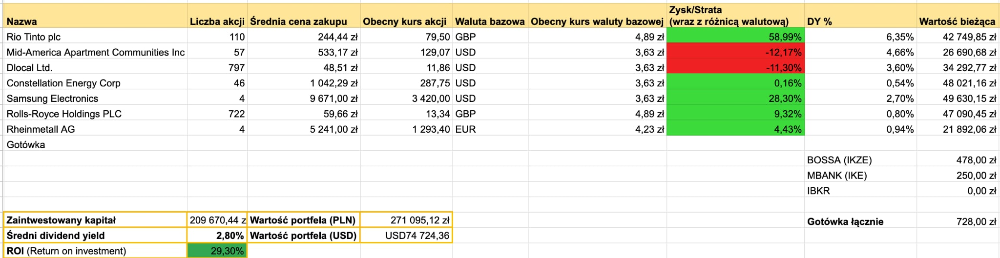

+++
title = "Podsumowanie portfela - maj 2026"
description = "Hossa trwa, wyceny rosną razem z oczekiwaniami." 
tags = [
    "podsumowanie"
]
date = 2026-06-01T09:00:00Z
author = "dywidendowo"
+++

Maj minął pod znakiem znacznych wzrostów na giełdzie, szczególnie amerykańskiej. Jak radził sobie portfel #dywidendowopl w minionym miesiącu? ☀️

**➡️ Sprzedaż/Zakup spółek z portfela.**

Nowa spółka, która zagościła w portfelu jest notowana na niemieckiej giełdzie Xetra. Rheinmetall (RHM) to spółka z sektora Aerospace / Defence, której kupiłem łącznie 4 akcje po średniej cenie 1238 euro za akcję. Widzę w niej spory potencjał szczególnie, że od początku roku akcje spadły o blisko 21%, budżety państw europejskich na zbrojenia wciąż rosną, a programy typu SAFE mogą być katalizatorem wzrostów.\
Dokupiłem jedną akcję Samsunga (po 2845 GBP za akcję), po ogłoszeniu świetnych wyników finansowych.\
Następnie dokupiłem 192 akcje Rolls Royce na koncie IKE po około 13 GBP za akcję.

**Zamknięte pozycje:**

- ABBN (zrealizowany zysk około 2927 CHF czyli około 13600 zł przed podatkiem, +50%) - wysoki podatek od dywidendy w Szwajcarii, który wynosi aż 35% razem z pokaźnym profitem wygenerowanym w około 15 miesięcy sprawiły, że wolałem zaksięgować zysk i rozważyć sens zakupu spółek z tego marketu - raczej będę stronił od zakupów spółek stricte dywidendowych z tego marketu i takim też zakupem było ABB - które nie jest "krową dywidendową" a raczej spółką growth / dividend growth. Zatem spółki z tego rynku, będą raczej nastawione na krótszy horyzont inwestycyjny (typu 6-18 miesięcy).

**Otwarte nowe pozycje:**

- Rheinmetall (RHM) - 4 akcje po 1233,2 euro za akcję

**➡️ Dopłaty do portfela**

Jak co miesiąc dopłaciłem do portfela gotówkę 5500 zł – dopłacając do konta IBKR.

Jeżeli chodzi o wypłaty dywidend w maju wygląda to następująco:

**➡️ Otrzymane dywidendy💰:**

- MAA 127,85 zł (dywidenda na IKZE wpłynęła jeszcze w kwietniu)

Łączna kwota z dywidend w tym miesiącu to **127,85 zł.** W zeszłym roku w maju otrzymałem 876,93 zł dywidendy, zatem spadek y/y dywidendy to 85,4%.

**Wartość portfela na koniec miesiąca**: 271 095,12 zł (wzrost o 3,8% m/m, nie licząc dopłaty w maju).\
**Wolna gotówka w portfelu** 728 zł

---

### Portfel spekulacyjny/opcyjny

Maj zamknąłem na **+ 1560$ (+ 5659 zł, nie licząc podatku)**.\
Z czego
- +657 zł zysku na Votum w ramach #Spekulacja10k 
- -200 USD pozycja na Nintendo, którą szybko zamknąłem, rozwazalem dodanie do portfela dywidendowopl
- +184 USD zysku na OUST w ramch #Spekulacja10k
- +94 USD zysku na MRX w ramach portfela spekulacyjnego - przerzuciłem środki na ServiceNow o czym za chwilę, natomaist rozwazam dodanie MRX do portfela dywidendowopl
- +519 USD zysku na INFQ w ramach #Spekulacja10k
- +181 USD zysku na BRUN w ramach #Spekulacja10k
- +271 USD zysku na ONDS w ramach #Spekulacja10k
- +330 USD zysku na INFQ w ramach #Spekulacja10k 

Z uwagi na słabnące momentum na MRX i potencjalne gorsze wyniki za Q2, sprzedałem akcje w małym zysku w ramach portfela spekulacyjno-opcyjnego i pod koniec miesiąca zakupiłem NOW, którego price action (wraz z rosnącnym wolumenem), zakupy insiderów i lepszy sentyment wokół spółki zaczęły do mnie przemawiać. Kupiłem 100 akcji po 107,98 USD i na moment pisania tego postu czyli 4 dni po zakupie, niezrealizowany zysk wynosi +24%. Wow! Mam zamiar obserować wykres, wolumen i pomyśleć kiedy jest dobry moment na sprzedaż. Natomiast taki zwrot w zaledwie kilka dni, to jest coś czego się nie spodziewałem. Kupując NOW myślałem o horyzoncie kilku miesięcy, natomiast tak intensywne wzrosty w zaledwie parę dni, ochłodziły nieco moje długoterminowe nastawienie, gdzie wyjściowo chciałem sprzedać NOW w okolicach 140 USD, a możliwe że te rejony będziemy testować już niebawem. W związku z tym, możliwe że spółkę sprzedam zdecydowanie szybciej niż zakładałem.

Pod koniec miesiąca zakupiłem w ramach #Spekulacja10k jeszcze raz ONDS (po spadkach i po pierwszej mojej transakcji na tym walorze) oraz PLTR. Obie pozycje są nadal otwarte na chwilę pisania tego postu czyli 01.06 12:00.

Kolejne podsumowanie już za miesiąc!\
Jeśli masz ochotę wesprzeć moją twórczość - postaw mi kawę: [https://buycoffee.to/dywidendowo](https://buycoffee.to/dywidendowo). Dzięki!

---

Serdecznie zachęcam do śledzenia na platformie [X](https://x.com/dywidendowopl) 🤙🏼

*Wszelkie dane, materiały i posty znajdujące się na blogu dywidendowo.pl nie mogą być traktowane jako porada inwestycyjna lub wiążąca ocena rynku albo instrumentu inwestycyjnego.*