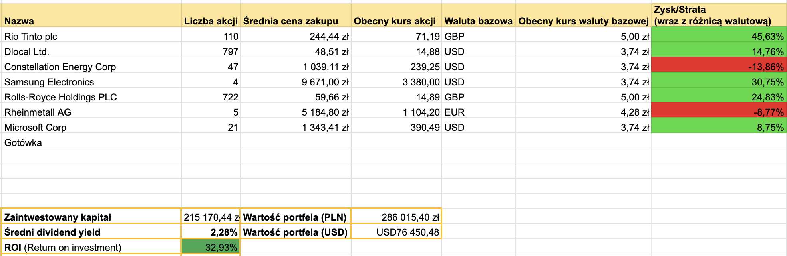

+++
title = "Podsumowanie portfela - czerwiec 2026"
description = "Moment zwątpienia na giełdzie..." 
tags = [
    "podsumowanie"
]
date = 2026-07-03T09:00:00Z
author = "dywidendowo"
+++

Kolejny miesiąc na giełdach minął niespodziewanie szybko. Sporo spółek zaliczyło małą korektę. Jak radził sobie portfel #dywidendowopl w czerwcu? ☀️

**➡️ Sprzedaż/Zakup spółek z portfela.**

Pod koniec miesiąca po znacznych spadkach Microsoftu, zacząłem ponownie myśleć nad dodaniem tej spółki do portfela. Jednak brak środków utrudniał dokupienie jakichkolwiek akcji. Postanowiłem sprzedać całą pozycję MAA (REIT) i za te środki kupić akcje MSFT. Dlaczego sprzedałem MAA? Nadal spółka mi się podoba, jednak jest to raczej spółka defensywna, na gorsze czasy, kiedy REITy amortyzują spadki portfela. Natomiast jestem w momencie, gdzie ten max drawdown nie jest mi aż tak bardzo straszny. Mam nadzieję, że nie zabrzmiało to zbyt zarozumiale. Pozycję zamknąłem z 5% stratą (nie licząc wszystkich dywidend, które spłyneły przez blisko 800 dni trzymania akcji w portfelu). MSFT traktuję, jako spółkę z ogromnym potencjałem, niedowartościowaną, z rosnącymi przychodami w solidnym tempie. Szczególnie przemawia do mnie wzrost przychodów z chmury (główny partner chmurowy OpenAI), Githuba Copilota, MS 365, LinkedIn (kto wiedział, że Microsoft posiada także tę platformę?). Kupiłem więc 21 akcji MSFT na kontach IKE i IKZE, za kwotę około 30 tysięcy złotych.

Po dużych spadkach RHM dokupiłem jedną po 939,80 euro za akcję, wykorzystując margin na koncie IBKR.

**Zamknięte pozycje:**

- MAA, zaksięgowana strata około 5%, nie licząc dywidend

**Otwarte nowe pozycje:**

- Microsoft (MSFT) - 21 akcje po 359$ za akcję

**➡️ Dopłaty do portfela**

Jak co miesiąc dopłaciłem do portfela gotówkę 5500 zł – dopłacając do konta IBKR.

Jeżeli chodzi o wypłaty dywidend w maju wygląda to następująco:

**➡️ Otrzymane dywidendy💰:**

- DLO 580 zł
- CEG 66 zł
- MRX 119 zł
- META 39 zł

Łączna kwota z dywidend w tym miesiącu to **804 zł.** W zeszłym roku w maju otrzymałem 308,40 zł dywidendy, zatem wzrost dywidendy y/y to 161%.

**Wartość portfela na koniec miesiąca**: 286 015,40 zł (wzrost o 3,47 m/m, nie licząc dopłaty w maju).\
**Wolna gotówka w portfelu** 1738 zł (-939,80 euro za zakup RHM, po wpłacie w lipcu ureguluję marign)

---

### Portfel spekulacyjny/opcyjny

Czerwiec zamknąłem na **+ 3097$ (+ 11 584 zł, nie licząc podatku)**.\
Z czego
- +178 USD zysku na ONDS #Spekulacja10k 
- +179 USD zysku na PLTR #Spekulacja10k
- +2750 USD zysku na NOW - zakup z portfela spekulacyjno-opcyjnego

Zadowolony byłem ze swojej sprzedaży MRX i przerzuceniu środków w NOW, który wygenerował blisko 2800 USD zysku w dwa dni. Jeszcze bardziej byłem zadowolony, kiedy po próbach testowania oporu w okolicach 140$, nie będąc zbytnio pazernym, zadowoliłem się zyskiem rzędu 25%. Później wraz z obniżeniem nastrojów wśród SaaSów i "zagłady wszystkiego przez AI" wróciliśmy do spadków, gdzie zająłem po kilkunastu dniach, nieco mniejszą pozycję (85 akcji w cenie ~105 USD). 
Dodatkowo w ramach zagrania z krótszym horyzontem czasowym zakupiłem 20 akcji META i 200 akcji POET. Wszystkie trzy pozycje są nadal otwarte na chwilę pisania postu.

Kolejne podsumowanie już za miesiąc!\
Jeśli masz ochotę wesprzeć moją twórczość - postaw mi kawę: [https://buycoffee.to/dywidendowo](https://buycoffee.to/dywidendowo). Dzięki!

---

Serdecznie zachęcam do śledzenia na platformie [X](https://x.com/dywidendowopl) 🤙🏼

*Wszelkie dane, materiały i posty znajdujące się na blogu dywidendowo.pl nie mogą być traktowane jako porada inwestycyjna lub wiążąca ocena rynku albo instrumentu inwestycyjnego.*