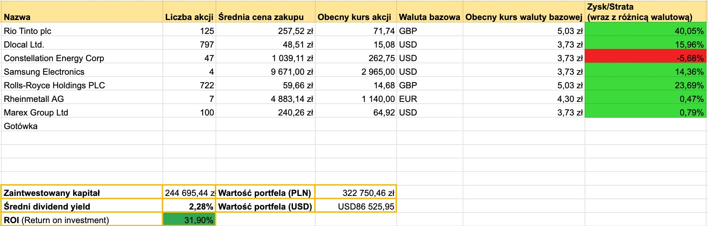

<!-- +++
title = "Podsumowanie portfela - lipiec 2026"
description = "Zaczęło bujać łajbą..." 
tags = [
    "podsumowanie"
]
date = 2026-08-03T09:00:00Z
author = "dywidendowo"
+++

Lipiec 2026 roku nie cieszył się świetną pogodą. A co z giełdą? Tutaj działo się zdecydowanie więcej i można było poczuć się jak podczas letnich wakacji nad Bałtykiem. Raz słońce i wzrosty, a następnego dnia spadki o kilkanaście procent. Na nudę nie mogliśmy narzekać. Jak radziły sobie moje portfele? 

**➡️ Sprzedaż/Zakup spółek z portfela.**

Z uwagi na brak środków w głównym portfelu dywidendowopl i nadmiar gotówki w portfelu spekulacyjno-opcyjnym, przetransferowałem ponad 6k USD do głównego portfela w celu zakupu spółki Marex Group Ltd. Spółka była już w maju w portfelu spekulacyjnym, jednak sprzedałem ją z niewielkim zyskiem w obawie o przeciętne wyniki za Q2, spowodowane wakacyjnym marazmem na giełdzie i mniejszą zmiennością. Jednak gdy zobaczyłem co zaczęło się dziać w lipcu, kiedy VIX podskoczył do blisko 20, pomyślałem, że te wyniki wcale nie muszą być aż tak złe.  Co więcej spółka jest nadal "tania", wypłaca dywidendę i w świetnym tempie zwiększa zyski. Dodatkowo jest spółką antycykliczna (ang. countercyclical) i takiej spółki brakowało mi w układance mojego portfolio. Dlatego zakupiłem 100 akcji tej spółki do portfela long-term, z perspektywą rozbudowy pozycji w przyszłości.

Po świetnych wynikach Rio Tinto, dokupiłem 15 akcji na koncie IKZE. Oprócz tego zakupiona jedna akcja CEG i RHM.

**Zamknięte pozycje:**

- MSFT, zaksięgowana zysk około 11% (+/- 3000zł) - sprzedaż przed wynikami finansowymi, kiedy na rynkach 29 lipcach lała się krew. Okazało się to niezbyt dobrym pomysłem, gdyż po świetnych wynikach akcje spółki wzrosły o około 15%. Niemniej z samego zakupu w okolicach 200 MA, pod koniec czerwca, byłem zadowolony. Zysk ponad 11% na kontach IKE i IKZE, w niewiele ponad miesiąc powininen zawsze cieszyć! 

**Otwarte nowe pozycje:**

- Marex Group (MRX) - 100 akcji po 63,47$ za akcję

**➡️ Dopłaty do portfela**

Jak co miesiąc dopłaciłem do portfela gotówkę 5500 zł – dopłacając do konta IBKR. Oprócz tego przeniosłem 24k złotych z drugiego portfela, co opisałem powyżej. Na koniec miesiąca dopłaciłem extra 5500zł do portfela.

Jeżeli chodzi o wypłaty dywidend w maju wygląda to następująco:

**➡️ Otrzymane dywidendy💰:**

Łączna kwota z dywidend w tym miesiącu to **0 zł.** W zeszłym roku w lipcu otrzymałem 405,73zł dywidendy.

**Wartość portfela na koniec miesiąca**: 322 750,46 zł (wzrost o 0,6% m/m, nie licząc dopłaty w lipcu).\
**Wolna gotówka w portfelu** 30 697 zł

---

### Portfel spekulacyjny/opcyjny

Lipiec zamknąłem na **-1953,97$ (-7285 zł)**.\
Z czego
- -961 USD straty na POET #Spekulacja10k 
- -109 USD straty na META - zakup z portfela spekulacyjno-opcyjnego
- +107 USD zysku na NOW - zakup z portfela spekulacyjno-opcyjnego
- -1822 USD straty na NVO - zakup z portfela spekulacyjno-opcyjnego (opcja LEAPS)
- +244,88 USD zysku na CRWV - zakup z portfela spekulacyjno-opcyjnego
- +586,15 USD zysku na ONDS #Spekulacja10k, zysk wygenerowany w dwa dni po zakupie LEAPS 

W lipcu zamknąłem (sprzedając opcję CALL) na Novo Nordisk, realizując stratę blisko 75% czyli 1822$, która w głównej mierze przyczyniła się do słabego zwrotu w lipcu. Nauczka na przyszłość, żeby szybciej realizować zyski (pozycja była w zysku blisko miesiąc po zakupie), bądź szybciej ciąć straty, zamiast czekać na cud. Zupełnie inaczej (lepiej) wyszło zagranie na Ondas, gdzie przy wspraciu, zakupiłem opcję CALL i dwie sesje później, zrealizowałem zysk około 25%. Zamiast łudzić się, że zysk będzie kilkukrotnie wyższy, szybko zgarnąłem solidny profit. Rozważam otwarcie podobnej pozycji po wynikach kwartalnych.

Obecnie w portfelu spekulacyjnym znajdują się trzy pozycje - MP Materials (LEAPS), RocketLab (akcje spot) i Nvidia (akcje spot). Wszystkie raprtują wyniki w sierpniu, póki pozycje otwarte, nie zamierzam zamykać żadnej z nich. 

Taka forma spekulacji i zagrań krótkoterminowych póki co odpowiada mi najbardziej, czyli 10k zł (do 3k USD) to opcja typu LEAPS - większa dźwignia, a reszta kapitału czyli około 15k USD to zwykłe akcje.

Kolejne podsumowanie już za miesiąc!\
Jeśli masz ochotę wesprzeć moją twórczość - postaw mi kawę: [https://buycoffee.to/dywidendowo](https://buycoffee.to/dywidendowo). Dzięki!

---

Serdecznie zachęcam do śledzenia na platformie [X](https://x.com/dywidendowopl) 🤙🏼

*Wszelkie dane, materiały i posty znajdujące się na blogu dywidendowo.pl nie mogą być traktowane jako porada inwestycyjna lub wiążąca ocena rynku albo instrumentu inwestycyjnego.* -->