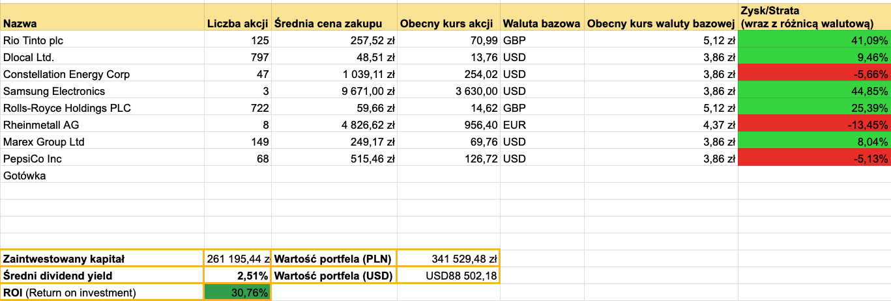

+++
title = "Podsumowanie portfela - sierpień TESTY 2026"
description = "Koniec wakacji" 
tags = [
    "podsumowanie"
]
date = 2026-09-01T09:00:00Z
author = "dywidendowo"
+++

Wrzesień, początek jesieni i koniec wakacji. Końcówka trzeciego kwartału nie była zbyt udana jeśli chodzi o perfomance moich portfeli, którę prowadzę. Natomiast nie mogę narzekać, rynek zaskakiwał,  poszczególne spółki przechodziły różne kryzysy, między innymi FICO czy MDB...

**➡️ Sprzedaż/Zakup spółek z portfela.**

We wrześniu skróciłem nieco pozycję na spółce Samsung, sprzedając jedną akcję na londyńskiej giełdzie i zgarnąłem 30% zysku ze stołu. Dokupiłem natomiast 26 akcji spółki PepsiCo, po ostatnich spadkach.

**Zamknięte pozycje:**

Brak.

**Otwarte nowe pozycje:**

Brak.

**➡️ Dopłaty do portfela**

Jak co miesiąc dopłaciłem do portfela gotówkę 5500 zł – dopłacając do konta IBKR.

Jeżeli chodzi o wypłaty dywidend w siernpiu wygląda to następująco:

**➡️ Otrzymane dywidendy💰:**

- Samsung 81,52 zł
- Marex Group 91 zł
- CEG 64 zł 
- PepsiCo 203,66 zł
- Rolls Royce 219,32 zł
- Rio Tinto 996,14 zł

Łączna kwota z dywidend w tym miesiącu to **1655,64 zł.**

**Wartość portfela na koniec miesiąca**: 341 529,48 zł(spadek o 2,46% m/m, nie licząc dopłaty we wrześniu).\
**Wolna gotówka w portfelu** 4 908,16 zł

---

### Portfel spekulacyjny/opcyjny

Wrzesień zamknąłem na **+665,36 $ (2561,61 zł)**.\
Z czego
- +77,15 USD zysku na NVDA - zakup z portfela spekulacyjno-opcyjnego
- -26,84 USD straty na ORCL - zakup opcji z portfela spekulacyjno-opcyjnego
- +82,42 USD zysku na AVGO - zakup z portfela spekulacyjno-opcyjnego
- +58,69 USD zysku na RVI - #Spekulacja10k
- +69,87 USD zysku na MDA - #Spekulacja10k
- -179,30 ZŁ straty na Odlewniach - #Spekulacja10k
- +152,65 USD zysku na MDB - #Spekulacja10k
- +297,99 USD zysku na MDB - zakup opcji z portfela spekulacyjno-opcyjnego, natomiast tego samego dnia sprzedałem tę opcję z uwagi na Investor Day kolejnego dnia i zamieszanie z CEO

Obecnie w portfelu spekulacyjnym znajdują się trzy pozycje - AppLovin (LEAPS) i HIVE (LEAPS). Obie spółki raportowały wyniki w sierpniu. Wyniki kwartalne wszystkich trzech spółek w mojej opinii były świetne. Uważam że jest potencjał do kolejnych wzrostów i na razie nie zamykam pozycji. Spodziewam się gorszego performance'u we wrześniu, natomiast w czym bliżej końca roku, tym bardziej pozycje powinny zacząć oddawać.

Kolejne podsumowanie już za miesiąc!\
Jeśli masz ochotę wesprzeć moją twórczość - postaw mi kawę: [https://buycoffee.to/dywidendowo](https://buycoffee.to/dywidendowo). Dzięki!

---

Serdecznie zachęcam do śledzenia na platformie [X](https://x.com/dywidendowopl) 🤙🏼

*Wszelkie dane, materiały i posty znajdujące się na blogu dywidendowo.pl nie mogą być traktowane jako porada inwestycyjna lub wiążąca ocena rynku albo instrumentu inwestycyjnego.*