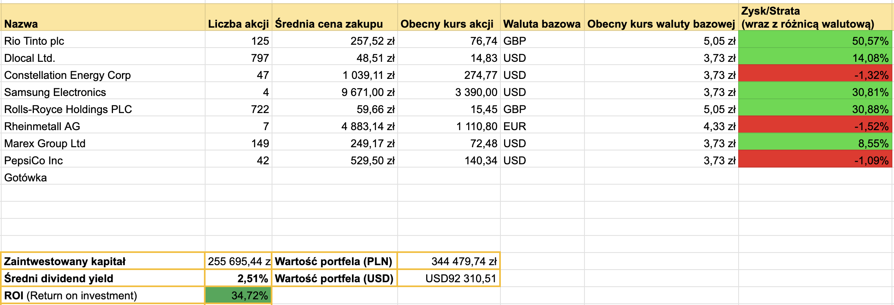

+++
title = "Podsumowanie portfela - sierpień 2026"
description = "Koniec wakacji" 
tags = [
    "podsumowanie"
]
date = 2026-09-01T09:00:00Z
author = "dywidendowo"
+++

Sierpień 2026 przyniósł kilka zmian w portfelach, które prowadzę. Dodałem jedną nową spółkę do portfela długoterminowego, dokupiłem kilka akcji pozostałych spółek. Niby spokojnie, niby mało zmian, ale portfel zbliżył się do 350.000 zł! Jak to było w szczegółach? 

**➡️ Sprzedaż/Zakup spółek z portfela.**

Z portfela dywidendowopl nie sprzedałem żadnej pozycji w sierpniu, natomiast pojawiła się jedna nowa. Otworzyłem pozycję na PepsiCo, której krótką analizę wysyłałem subskrybentom mojego newslettera. Zachęcam aby tam dołączyć: https://www.dywidendowo.pl/newsletter/ 👍🏼

Oprócz tego powiększyłem pozycję na Marex Group, dokupując kolejne 37 akcje.

**Zamknięte pozycje:**

Brak.

**Otwarte nowe pozycje:**

- PepsiCo (PEP) - 42 akcje po 142$ za akcję

**➡️ Dopłaty do portfela**

Jak co miesiąc dopłaciłem do portfela gotówkę 5500 zł – dopłacając do konta IBKR.

Jeżeli chodzi o wypłaty dywidend w maju wygląda to następująco:

**➡️ Otrzymane dywidendy💰:**

Łączna kwota z dywidend w tym miesiącu to **0 zł.**

**Wartość portfela na koniec miesiąca**: 344 479 zł (wzrost o 5% m/m, nie licząc dopłaty w sierpniu).\
**Wolna gotówka w portfelu** 774 zł

---

### Portfel spekulacyjny/opcyjny

Lipiec zamknąłem na **3231,60 $ (12078 zł)**.\
Z czego
- +734,22 USD zysku na RKLB - zakup z portfela spekulacyjno-opcyjnego
- +736,55 USD zysku na NVDA - zakup z portfela spekulacyjno-opcyjnego
- +1480,21 USD zysku na MP - zakup z portfela spekulacyjno-opcyjnego (opcja LEAPS)
- +253,63 USD zysku na HIVE - #Spekulacja10k

Obecnie w portfelu spekulacyjnym znajdują się trzy pozycje - AppLovin (LEAPS), Nvidia (akcje spot) i HIVE (LEAPS). Wszystkie trzy spółki raportowały wyniki w sierpniu. Wyniki kwartalne wszystkich trzech spółek w mojej opinii były świetne. Uważam że jest potencjał do kolejnych wzrostów i na razie nie zamykam pozycji. Spodziewam się gorszego performance'u we wrześniu, natomiast w czym bliżej końca roku, tym bardziej pozycje powinny zacząć oddawać. Nie mam wolnej gotówki ani w portfelu long-term ani w portfelu spekulacjno-opcyjnym. Przewiduję także, że dolar nie będzie się umacniał, raczej będziemy świadkami dalszej konsolidacji w okolicach 3,70 (USDPLN), bądź kolejnych spadków. NFA, DYOR.

Kolejne podsumowanie już za miesiąc!\
Jeśli masz ochotę wesprzeć moją twórczość - postaw mi kawę: [https://buycoffee.to/dywidendowo](https://buycoffee.to/dywidendowo). Dzięki!

---

Serdecznie zachęcam do śledzenia na platformie [X](https://x.com/dywidendowopl) 🤙🏼

*Wszelkie dane, materiały i posty znajdujące się na blogu dywidendowo.pl nie mogą być traktowane jako porada inwestycyjna lub wiążąca ocena rynku albo instrumentu inwestycyjnego.*